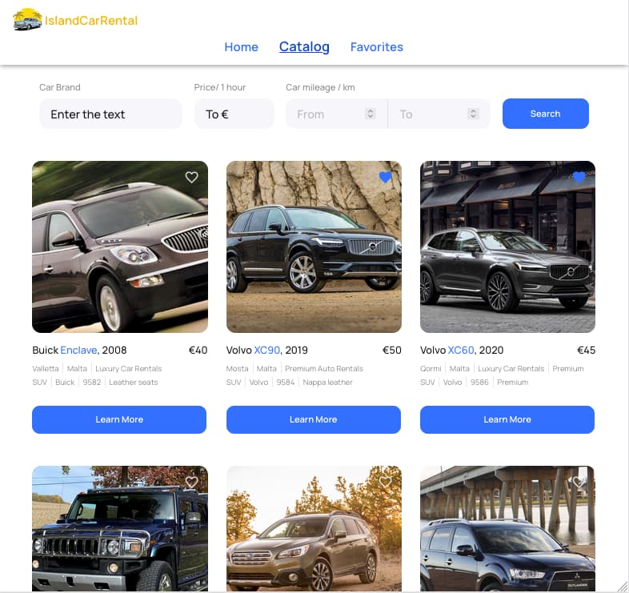

# IslandCarRental - React app :red_car:

Greetings and welcome to our Car Rental Application! Our platform simplifies the
car rental process, enabling users to swiftly locate and hire a vehicle. We
provide a seamless experience by offering customizable search options and a
dedicated favorites page, ensuring convenience and ease throughout the process
:red_car:

It allows users to:

- [x] browse a catalog of cars available for rent
- [x] add cars to their favorites
- [x] view detailed information about each car
- [x] filter cars catalogue

## References

Live page: [**IslandCarRental**](https://nanatsk.github.io/car-rental-app/)

## Technologies used:

| `FrontEnd`        | `BackEnd`  | `General`  |
| ----------------- | ---------- | ---------- |
| HTML5/CSS3        | Mockapi.io | VSCode     |
| JavaScript        |            | GIT/GitHub |
| React             |            | Figma      |
| Redux Toolkit     |            |            |
| React Router      |            |            |
| Axios             |            |            |
| Styled Components |            |            |
| Material-UI       |            |            |

## Installation & Scripts

1. Clone the repository: `git clone https://github.com/NanaTsK/car-rental-app`
2. Install the dependencies: `npm install`
3. Run development mode: `npm run dev`
4. Start local server: `npm start`
5. Run production build: `npm build`

:blue_heart::yellow_heart:
